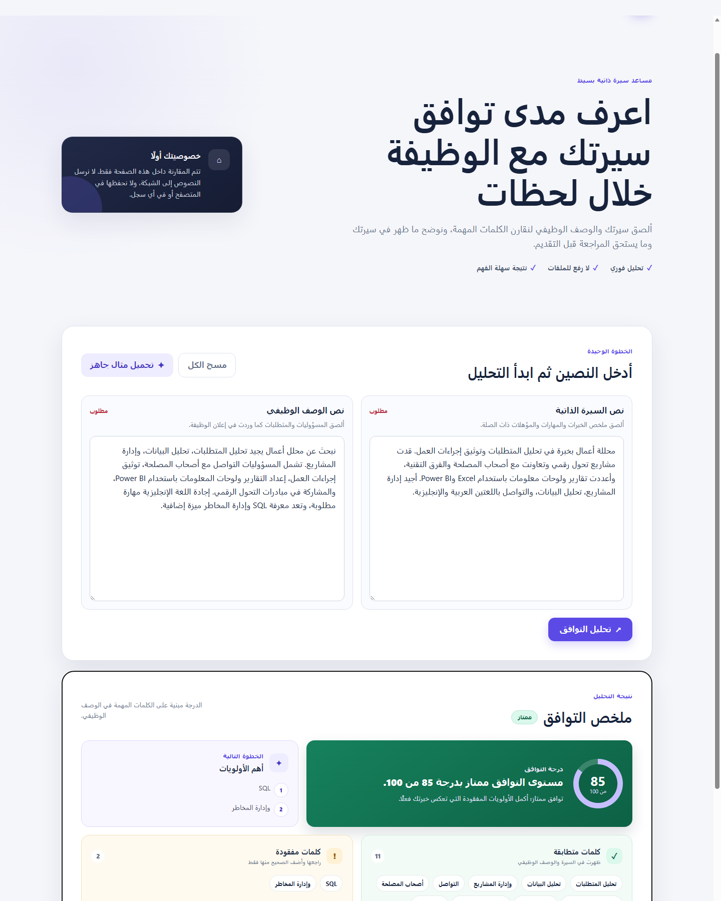
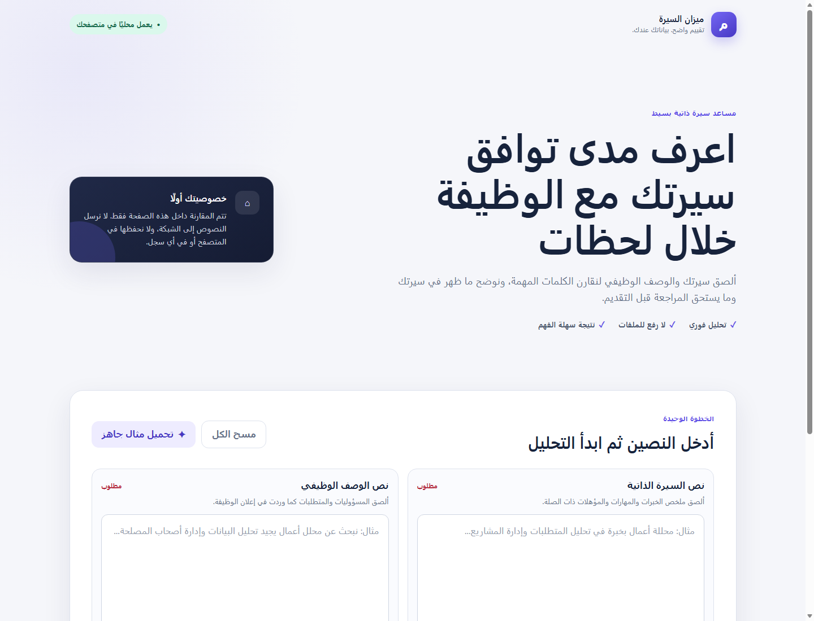

# ميزان السيرة — AI CV Assistant

[](#التحقق)
[](#الخصوصية)
[](#التشغيل-المحلي)

مساعد عربي محلي يقارن نص السيرة الذاتية بالوصف الوظيفي، ثم يعرض درجة توافق مفهومة والمهارات المتطابقة وأهم الأولويات المفقودة. يعمل بالكامل داخل المتصفح بلا API أو رفع ملفات أو تخزين للنصوص.

**[جرّب النسخة المنشورة](https://fatmahameer.github.io/AI-CV-Assistant/)** · **[افتح مثالًا جاهزًا](https://fatmahameer.github.io/AI-CV-Assistant/?demo=1)** · **[حمّل ZIP](AI_CV_Assistant_Submission.zip)**



> النتيجة إرشادية لتحسين وضوح السيرة، وليست قرار توظيف أو بديلًا عن المراجعة المهنية.

## الفكرة في سطرين

ألصق السيرة والوصف الوظيفي، وسيحلل التطبيق المتطلبات محليًا ويعرض درجة من 100 مع تفسير واضح. يدعم اختلافات الكتابة العربية والعبارات المهنية مثل «تحليل البيانات» و«إدارة المشاريع» ويقترح أهم ثلاث أولويات فقط.

## لماذا هذه النسخة أفضل؟

- مطابقة عربية محسنة للحروف والهمزات وأل التعريف وحروف العطف.
- تعامل مع المهارات متعددة الكلمات مثل `Power BI` و`إدارة المشاريع` كوحدة واحدة.
- نتيجة تشرح المستوى بدل عرض رقم بلا سياق.
- أهم الأولويات في قائمة قصيرة قابلة للتنفيذ.
- مثال جاهز وزر لمسح الكل وتجربة RTL متجاوبة وقابلة للاستخدام بلوحة المفاتيح.
- صفر مكتبات خارجية وصفر اتصالات شبكة من التطبيق.

## التشغيل المحلي

المتطلب الوحيد هو **Node.js**. من PowerShell داخل مجلد المشروع:

```powershell
node scripts/serve.mjs
```

ثم افتح `http://127.0.0.1:8000`. للتجربة المباشرة بالمثال استخدم `http://127.0.0.1:8000/?demo=1`، ولإيقاف الخادم اضغط `Ctrl+C`.

## دور الوكيل والـSkill

- الوكيل المخصّص: [`.codex/agents/qa.toml`](.codex/agents/qa.toml)، ومهمته مراجعة السلوك والخصوصية والأمان وإتاحة الاستخدام بصورة مستقلة.
- الـSkill المستخدمة: [`.agents/skills/ai-cv-agent-loop/SKILL.md`](.agents/skills/ai-cv-agent-loop/SKILL.md)، ونظّمت العمل عبر التخطيط والبناء والدمج والملاحظة والتصحيح والتحقق.
- نفّذ وكيل backend المحلل والاختبارات، ونفّذ وكيل frontend الواجهة، ثم اختبر وكيل QA التدفق المتكامل مستقلًا. سُجلت الملاحظات وصُححت وأعيد اختبارها قبل النشر.

## التحقق

```powershell
node --test tests/analyzer.test.mjs
node --test .agents/skills/ai-cv-agent-loop/tests/loop.test.mjs
node --check app.js
node --check analyzer.js
node --check scripts/serve.mjs
```

- اختبارات المحلل: **8/8 ناجحة**.
- اختبارات دورة الوكلاء: **5/5 ناجحة**.
- المثال العام: **85/100 — ممتاز**، مع `SQL` و«إدارة المخاطر» كأولويتين واضحتين.
- تم التحقق من العرض في Microsoft Edge على سطح المكتب والجوال، ومن حالات الخطأ وإعادة الضبط والخصوصية.

## الخصوصية

- لا يستخدم التطبيق `fetch` أو XHR أو WebSocket.
- لا يستخدم cookies أو `localStorage` أو `sessionStorage`.
- لا يسجل نص السيرة في وحدة التحكم.
- يستبعد البريد والروابط وأرقام الهاتف من التحليل.
- يمنع [`.gitignore`](.gitignore) رفع `.env` وملفات الأسرار المحلية.

## لقطات الشاشة

| البداية | المثال والنتيجة |
| --- | --- |
|  |  |

## الملفات الرئيسية

```text
AI-CV-Assistant/
├── index.html                 # الواجهة
├── styles.css                # التصميم المتجاوب
├── app.js                    # التفاعل وعرض النتيجة
├── analyzer.js               # التحليل المحلي
├── tests/analyzer.test.mjs   # اختبارات الوظيفة
├── scripts/serve.mjs         # خادم محلي صغير
├── PLAN.md                    # الخطة والعقد
├── .codex/agents/qa.toml     # وكيل المراجعة
├── .agents/skills/ai-cv-agent-loop/
└── screenshots/
```

لم تُستخدم خدمة ذكاء اصطناعي خارجية في وقت التشغيل؛ كلمة AI هنا تصف فكرة المساعد وطريقة تطويره بمساعدة Codex، بينما تبقى النتيجة محلية وحتمية وقابلة للاختبار.
